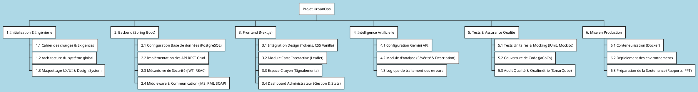
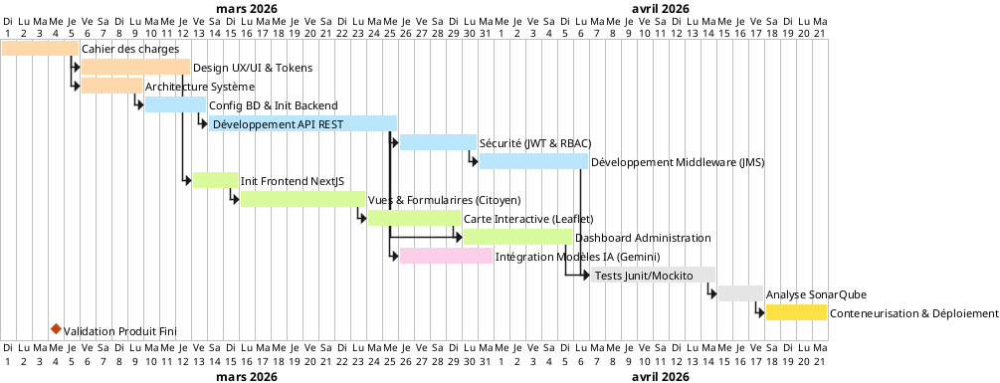
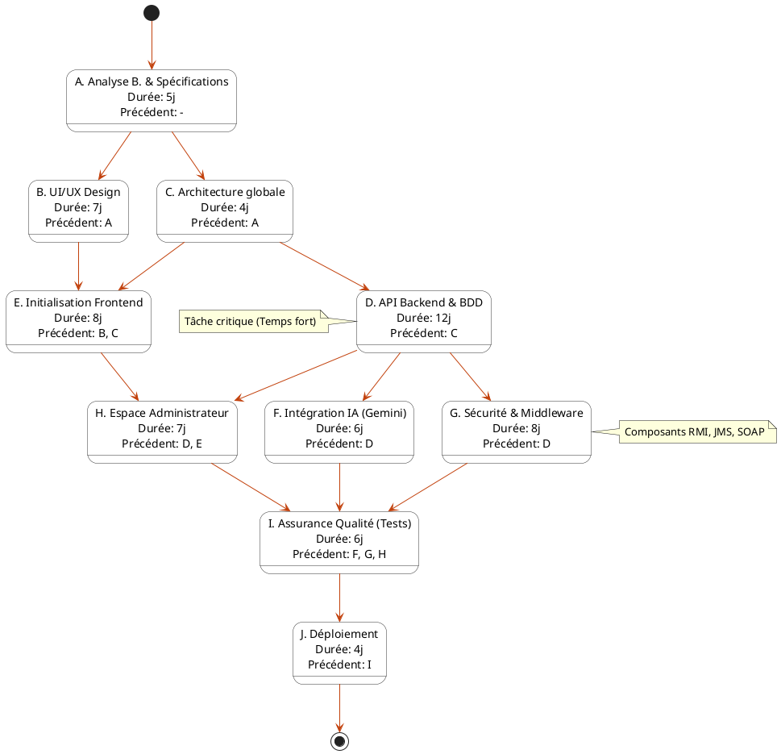

# Tableaux & Diagrammes de Gestion de Projet - UrbanOps

Ce document contient les codes sources PlantUML pour les diagrammes du projet **UrbanOps**. Vous pouvez les compiler en utilisant le plugin de PlantUML dans un éditeur (VSCode, IntelliJ), via un serveur en ligne (comme PlantText, PlantUML Web Server) ou encore en les convertissant avec l'outil CLI de PlantUML.

---

## 1. Work Breakdown Structure (WBS)
Le WBS (Structure de Découpage du Projet) divise le travail complet en hiérarchie orientée sur les tâches à livrer qui seront exécutées par l'équipe projet.

---

## 2. Diagramme de Gantt
Il illustre le calendrier de développement avec les dépendances techniques, très utile pour montrer la progression temporelle. Les tâches critiques figurent parmi les modules structurants.

---

## 3. Diagramme de PERT (Version Modèle de Réseau / État)
PlantUML ne possède pas un outil natif ultra restrictif nommé « PERT », mais les praticiens utilisent le diagramme d'activité/états pour générer une vue de chemins critiques PERT claire et professionnelle.

---
### Commandes pour la compilation
Pour compiler ou re-visualiser les diagrammes ci-dessus :
- Rendez-vous sur le site officiel PlantUML [serveur de test](https://plantuml.com/fr/server).
- Ou bien installez l'extension pour VSCode nommée `PlantUML` avec un serveur local/java.
